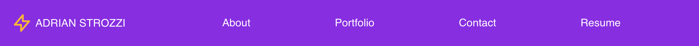
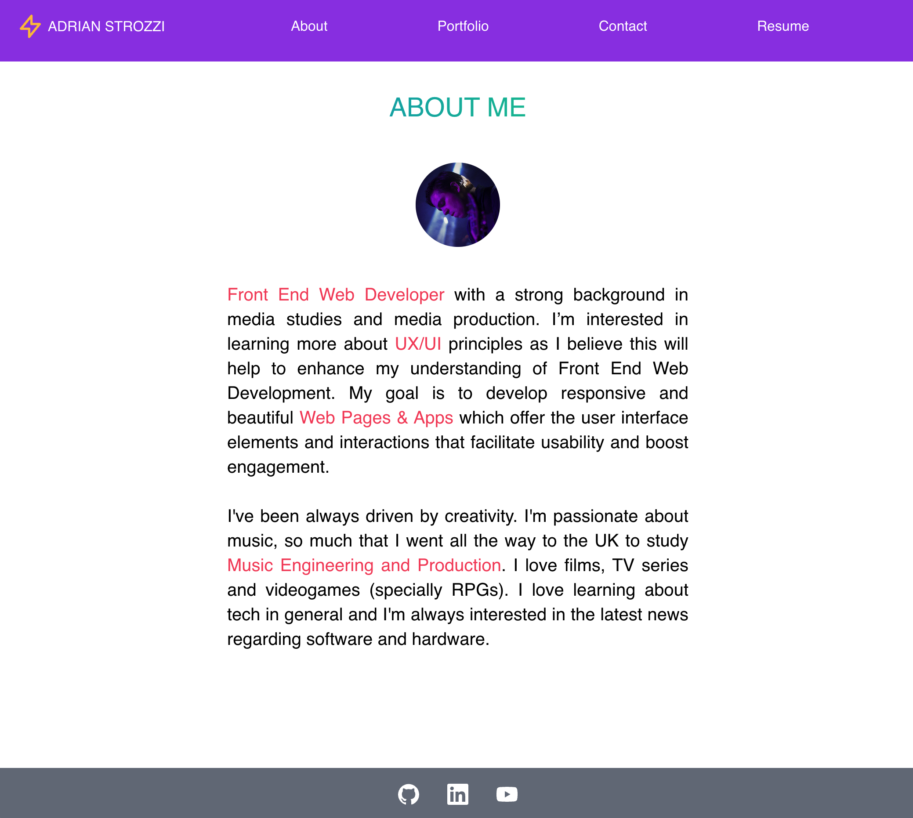
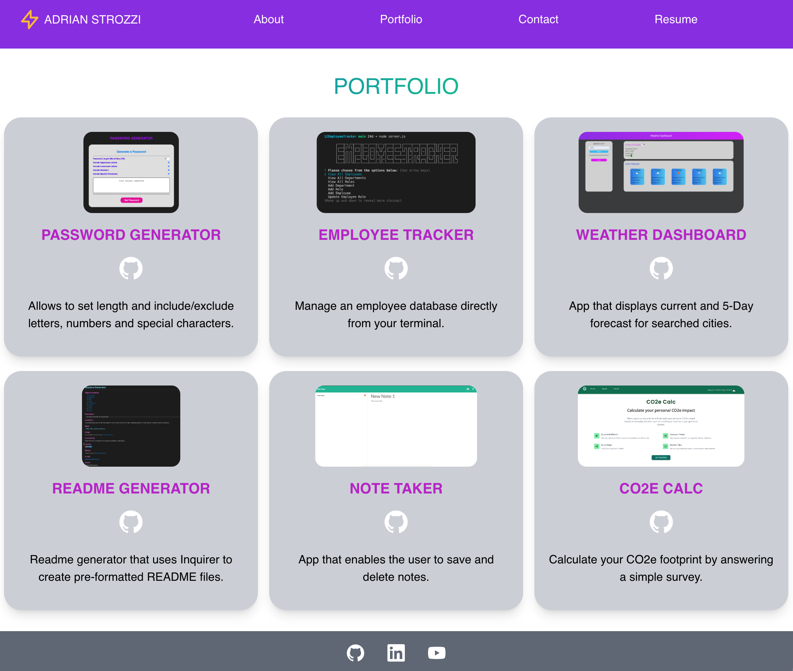
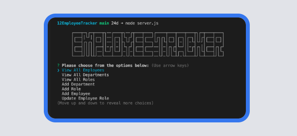
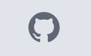
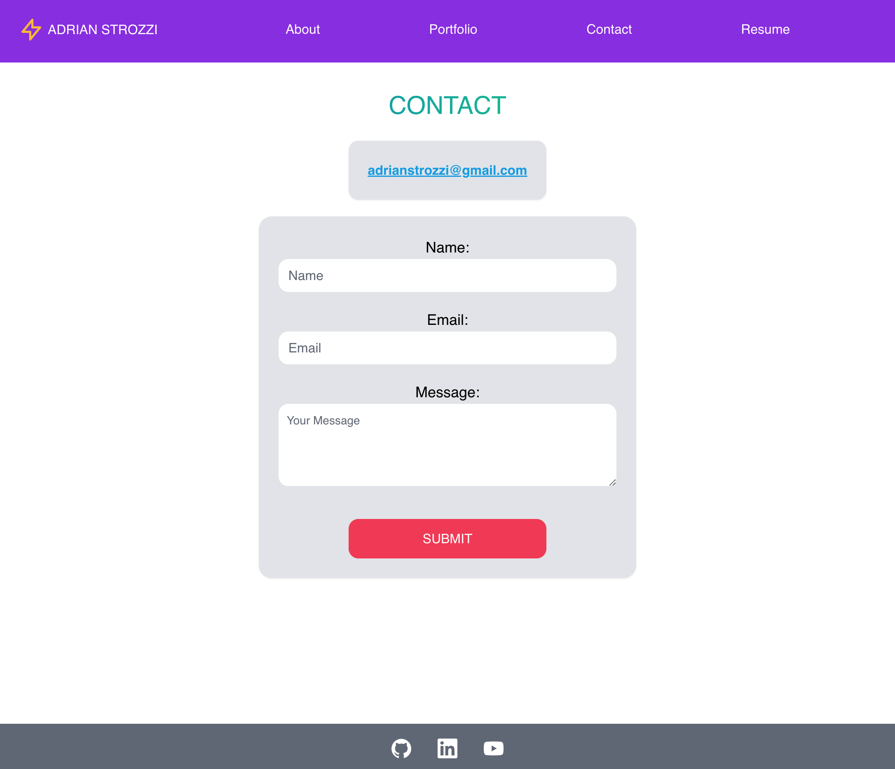
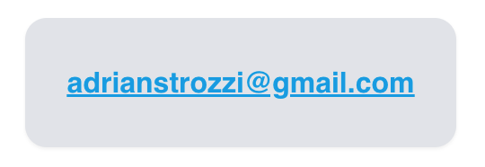
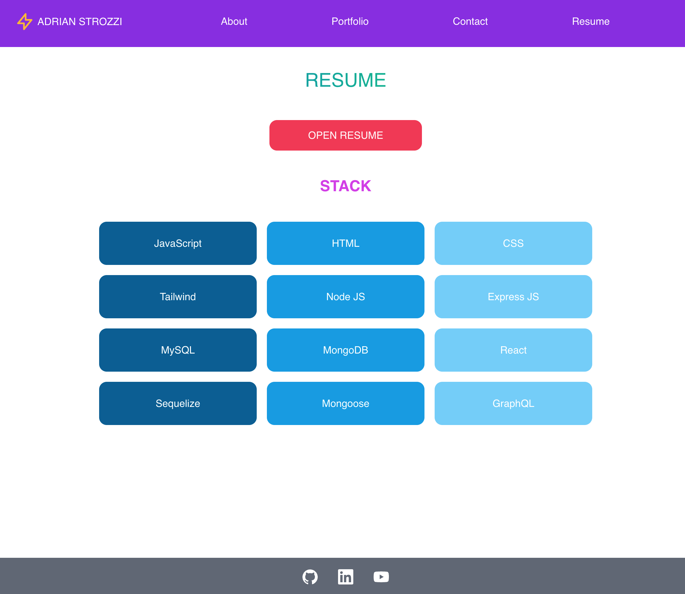
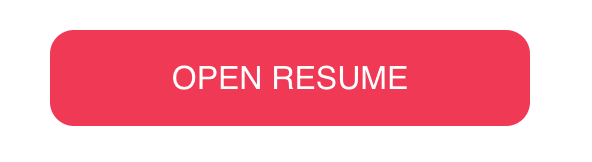
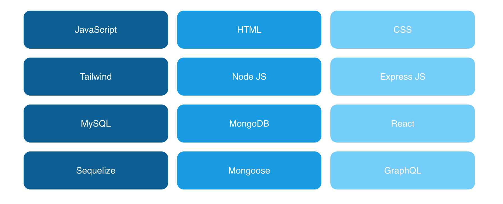

# **React Portfolio**

## Table of Contents

1. [Description](#Description)
2. [Stack](#Stack)
3. [Video Tutorial](#Video-Tutorial)
4. [Usage](#Usage)
5. [Credits](#Credits)
6. [License](#License)

## Description

> Welcome to my React Portfolio! This page uses React Router and React Components to create a seamless browsing experience.

## Stack

**1 - React** [(link)](https://reactjs.org/)

**2 - CSS** [(link)](https://developer.mozilla.org/en-US/docs/Web/CSS)

**3 - Tailwind** [(link)](https://tailwindcss.com/)

## Video Tutorial

Use this `link` to access my React Portfolio: [Adrian Strozzi - React Portfolio](https://adrianstrozzi.github.io/Tec20ReactPortfolio)

## Usage

Use the `Navbar` to go to the different secrtions of the page:

`Main/About` page:

`Portfolio` page:

You can click in the images of the `Apps` to go to the deployed page or click in the `GitHub icon` to go to the GitHub repository:

`Contact` page:

You can click in the `email` to open your default email App and compose an email:

`Resume` page:

You can click in the `Open Resume` to open a PDF resume and click in any of the `Stack` options to open their `mainpage/documentation`:

The `Footer` contains icons to visit my `GitHub`, `LinkedIn` and `YouTube` profiles:

## Credits

**Adrian Strozzi:** [https://github.com/adrianstrozzi](https://github.com/adrianstrozzi)

## License

**© 2022 Adrian Strozzi**:zap:
